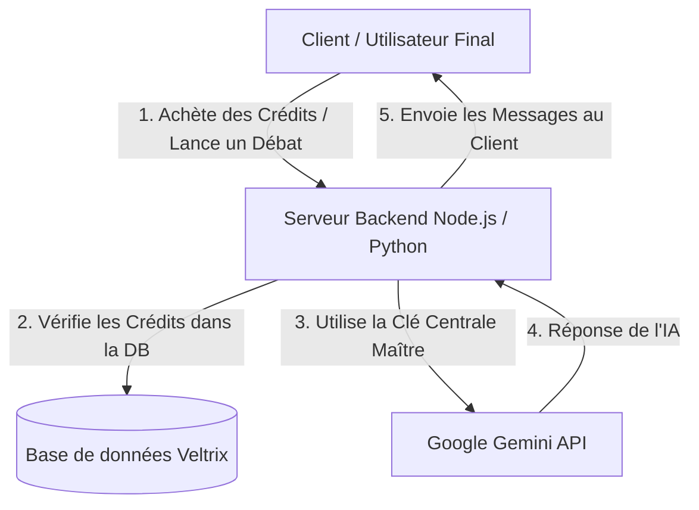

# Architecture de l'API Veltrix et Gestion des Clés

Ce guide explique en détail comment le système de gestion des clés API et l'orchestration des débats sont organisés dans Veltrix, depuis l'étape de développement (Banc d'Essai) aujourd'hui jusqu'à l'étape de production publique demain.

---

## 1. Le Banc d'Essai Aujourd'hui (Test Bench)

Pendant que nous développons et testons Veltrix, le Banc d'Essai situé dans la page `veltrix_api_test_bench (6).html` sert de laboratoire local :

* **Provenance de la Clé :** Chaque développeur ou administrateur saisit sa propre clé API personnelle (obtenue gratuitement sur Google AI Studio).
* **Sécurité Locale :** Cette clé est sauvegardée **uniquement dans votre navigateur** via la technologie `localStorage`. Elle ne voyage jamais sur un autre serveur et n'est visible par aucun autre utilisateur ou membre sur GitHub.
* **Utilisateurs :** Vous et l'équipe de développement êtes les seuls à l'utiliser pour vérifier que les "Entels" répondent correctement, que leurs personnalités sont respectées et que la logique du débat s'exécute sans erreur.

---

## 2. La Version Finale pour le Public (Production)

Lorsque la plateforme Veltrix sera prête à être mise en ligne pour tout le monde (en production), l'architecture évoluera vers un système professionnel **SaaS (Software as a Service)** :

* **Pas de Clé pour les Utilisateurs :** Les utilisateurs finaux **NE DOIVENT saisir aucune clé API**. Ils n'ont pas besoin de connaître Google AI Studio. Ils créent simplement un compte, cliquent sur "Lancer le débat", et profitent de l'expérience.
* **Clé API Centrale (Backend Gateway) :** C'est votre propre Clé API Centrale (en tant que propriétaire de la plateforme) qui s'exécutera en arrière-plan sur votre serveur (Backend Node.js/Python). Le fichier `.env` sécurisé chargera cette clé sur le serveur uniquement.
* **Modèle Économique (Monétisation) :** 
  1. Les utilisateurs achèteront des **Crédits** sur le site avec de l'argent réel (via Stripe, PayPal, etc.).
  2. Lorsqu'ils lanceront un débat, le système backend déduira les crédits de leur compte dans la base de données.
  3. Le serveur backend utilisera votre clé API payante pour appeler Gemini et renverra les réponses à l'utilisateur.
  4. De votre côté, vous paierez Google pour votre consommation réelle (pay-as-you-go), ce qui est très économique (quelques centimes pour des milliers de messages), grâce à l'argent que les utilisateurs ont payé pour leurs crédits. C'est un modèle à très forte marge !

---

## 3. Pourquoi rencontrons-nous l'erreur "Quota Exceeded" (Rate Limit) lors des Tests ?

Le message d'erreur de Google `429 Resource Exhausted` ou la limitation de vitesse survient pour deux raisons techniques :

* **Limite de la Version Gratuite (Free Tier Quota) :** Google applique des limites sur les clés gratuites pour éviter les abus. Actuellement, la limite est de **15 RPM (Requests Per Minute)** (requêtes par minute) sur Gemini 2.5 Flash.
* **Les Débats Multi-Entels sont Rapides :** Comme nous avons 2 Entels qui parlent rapidement et se répondent plusieurs fois (par exemple 6 à 8 répliques), le système envoie 6 à 8 requêtes très rapprochées à Google. La limite de 15 requêtes est rapidement atteinte si vous lancez le débat 2 fois dans la même minute.
* **Comment gérons-nous cela dans le code ?**
  Nous avons implémenté une logique de **Retry avec Exponential Backoff** dans le Banc d'Essai. Si Google signale une surcharge, le code attend automatiquement quelques secondes et réessaye pour éviter que le débat ne se bloque.
  *En production, avec une clé API payante (Pay-as-you-go), cette limite augmentera considérablement (par exemple 1000+ RPM), ce qui permettra à des milliers d'utilisateurs d'utiliser le site en même temps sans aucun ralentissement.*
