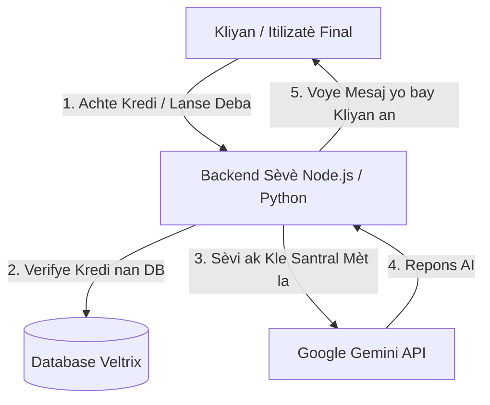

# Achitekti API Veltrix ak Jesyon Kle yo

Gid sa a eksplike an detay kijan sistèm jesyon kle API a ak okestrasyon deba yo òganize nan Veltrix, depi nan etap devlopman (Bann Tès) la jodi a pou rive nan etap pwodiksyon piblik la demen.

---

## 1. Bann Tès la Jodi a (Test Bench)

Pandan n ap devlope ak teste Veltrix, Bann Tès la nan paj `veltrix_api_test_bench.html` sèvi kòm yon laboratwa lokal :

* **Kote Kle a Soti :** Chak devlopè oswa administratè antre pwòp kle API pèsonèl pa yo (ke yo jwenn gratis sou Google AI Studio).
* **Sekirite Lokal :** Kle sa a sove **sèlman nan navigatè w la** gras ak teknoloji `localStorage`. Li pa janm vwayaje sou okenn lòt sèvè e li pa vizib pou okenn lòt itilizatè oswa manm sou GitHub.
* **Itilizatè yo :** Se sèlman ou menm ak ekip devlopman an k ap sèvi ak li pou verifye si "Entel" yo ap reponn byen, si pèsonalite yo respekte, epi si lojik deba a ap mache san erè.

---

## 2. Vèsyon Final la pou Piblik la (Pwodiksyon)

Lè platfòm Veltrix la pare pou l ale sou entènèt pou tout moun (an pwodiksyon), achitekti a ap chanje pou l vin yon sistèm pwofesyonèl **SaaS (Software as a Service)** :

* **Pa gen Kle pou Itilizatè yo :** Itilizatè final yo **PA DWE antre okenn kle API**. Yo pa bezwen konnen anyen sou Google AI Studio. Yo jis kreye yon kont, klike sou "Lancer le débat", epi jwi eksperyans lan.
* **Kle API Santral (Backend Gateway) :** Se pral pwòp Kle API Santral pa w la (antanke mèt platfòm lan) k ap kouri nan background nan sou sèvè w la (Backend Node.js/Python). Fichye `.env` ki sekirize a ap chaje kle sa a sou sèvè a sèlman.
* **Modèl Biznis (Monetizasyon) :** 
  1. Itilizatè yo ap achte **Kredi** sou sit la ak lajan reyèl (Stripe, Paypal, elatriye).
  2. Lè yo lanse yon deba, sistèm backend nan ap dedui kredi sou kont yo nan baz de done a (Database).
  3. Sèvè backend nan ap sèvi ak kle API pa w la pou rele Gemini, epi l ap retounen repons yo bay itilizatè a.
  4. Ou menm, w ap peye Google pou sa w konsome (pay-as-you-go), ki trè bon mache (kèk santim pou dè milye de mesaj), gras ak lajan itilizatè yo te peye w pou kredi yo. Sa a se yon modèl ki gen gwo pwofi !

---

## 3. Poukisa nou jwenn erè "Quota Exceeded" (Rate Limit) nan Tès yo ?

Mesaj erè Google `429 Resource Exhausted` oswa limitasyon vitès la rive pou de rezon teknik :

* **Limit Kle Gratis (Free Tier Quota) :** Google bay limit sou kle gratis yo pou evite abi. Kounye a limit la se **15 RPM (Requests Per Minute)** (demand pa minit) sou Gemini 2.5 Flash.
* **Deba Multi-Entel yo Rapid :** Paske nou gen 2 Entel k ap pale rapid epi k ap reponn youn lòt plizyè fwa (egzanp 6 a 8 replik), sistèm nan ap voye 6 a 8 demand trè rapid bay Google. Limit 15 demand lan ap rive nan bout li trè vit si w lanse deba a 2 fwa nan menm minit la.
* **Ki jan nou jere sa nan kòd la ?**
  Nou mete yon lojik **Exponential Backoff Retry** nan Bann Tès la. Si Google di gen twòp demand, kòd la ap rete tann kèk segonn otomatikman epi l ap re-eseye ankò pou evite deba a bloke.
  *Nan pwodiksyon, avèk yon kle API peye (Pay-as-you-go), limit sa a ap monte trè wo (pa egzanp 1000+ RPM), sa k ap pèmèt dè milye de moun sèvi ak sit la anmenmtan san okenn ralentisman.*
