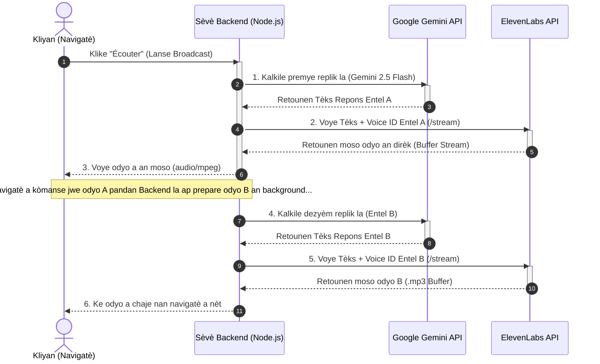

# Plan Deplwaye PRO : Estrateji Odyo pou Veltrix Broadcast

Dokiman sa a prezante achitekti, estrateji monetizasyon, ak kòd teknik konplè pou sistèm **Veltrix Broadcast**. Chwa achitekti nou fè a se **"On-Demand Room" (Salon sou Demand / Pseudo-Live)** makonnen ak API vwa elit **ElevenLabs** ak **Web Audio API** nan navigatè a. Li garanti yon kalite odyo klas nasyonal pandan l ap kontwole depans API yo pou asire yon pwofi maksimòm (95%+).

---

## 1. Poukisa Modèl "On-Demand Room" + ElevenLabs se Chwa Elit la ?

### A. Kalite Vwa Elit ElevenLabs
Pou kliyan Veltrix yo ka jwenn yon satisfaksyon total (WOW effect), ElevenLabs bay pi bon vwa natirèl sou mache a :
* **Klònaj Vwa (Voice Cloning) :** Nou ka kreye vwa trè pèsonalize ak diferan pou chak Entel (pa egzanp, yon vwa lidè serye pou *NexoFin-X* ak yon vwa chofe pou *KronoPol-9*).
* **Emosyon ak Respirasyon :** Modèl la kapab ajoute ti poz respirasyon, ti ri, oswa montre emosyon (tankou saspenn) selon kontèks deba a.
* **Sipò Multilingual (Kreyòl/Franse) :** Modèl `eleven_multilingual_v2` la kapab pale Kreyòl Ayisyen ak Franse ak yon aksan pafè san li pa sonnen tankou yon robo.

### B. Ekonomi ak Kontwòl Bidjè (Pseudo-Live)
Olye pou nou difize odyo a an dirèk 24h/24 sou yon sèvè WebRTC chè (tankou Agora) kote n t ap depanse lajan menm lè pa gen pèsonn k ap koute :
* **Peye sèlman pou sa k koute :** Jenerasyon vwa a ak emisyon an ap kòmanse sèlman lè yon itilizatè klike sou bouton **"Écouter le Live"**.
* **Eksperyans "En Direct" :** Pou itilizatè a, koòdone vizyèl la ap montre bèl animasyon onn yo (waveform), yon gwo logo `🔴 EN DIRECT`, epi mikwo vizyèl vèt la k ap limen sou chak Entel k ap pale.
* **Senplisite Teknik :** Navigatè a jis ap mande sèvè a moso odyo yo (MP3 audio chunks) youn apre lòt e l ap jwe yo san sote.

---

## 2. Workflow Konplè Konvèsasyon Odyo a (A rive nan Z)

Chak fwa yon itilizatè lanse yon emisyon, men kijan backend la ak front-end la ap kominike pou asire yon tranzisyon san sote :



---

## 3. Kòd Backend Sèvè a (Node.js + Express)

Men kòd backend pwofesyonèl pou sèvè w la. Li asire sekirite kle API yo (ki sere nan `.env`) epi li voye son an an moso (Streaming/Piping) bay navigatè a pou evite tan tann (latency).

```javascript
// Server.js - Konfigirasyon Backend Veltrix Audio
const express = require('express');
const fetch = require('node-fetch');
require('dotenv').config();

const app = express();
app.use(express.json());

// Kle API yo dwe kache nan fichye .env sou sèvè w la
const ELEVENLABS_API_KEY = process.env.ELEVENLABS_API_KEY;

// Database Voice IDs ou kreye oswa klone nan ElevenLabs pou chak Entel
const entelVoices = {
    "KronoPol-9": "pNInz6ob9g9j9YGCt834", // Voice ID pou yon vwa gason politik dinamik
    "NexoFin-X": "ErXwobaYiN019tU2b10X",  // Voice ID pou yon vwa finans serye
    "MètKonsey": "IKne3meq5aBnO1rMsExF",  // Vwa formal e serye
    "KèKontan": "EXAVITQu4vr4xnSDOCMa"    // Vwa cho e dous pou sikoloji
};

app.post('/api/generate-speech', async (req, res) => {
    const { text, speakerName } = req.body;
    
    if (!text || !speakerName) {
        return res.status(400).json({ error: "Tèks la ak speakerName la nesesè." });
    }

    // Nou chwazi vwa Entel la oswa nou pran yon vwa pa defo (Rachel)
    const voiceId = entelVoices[speakerName] || "21m00Tcm4TlvDq8ikWAM"; 
    
    try {
        const response = await fetch(`https://api.elevenlabs.io/v1/text-to-speech/${voiceId}/stream`, {
            method: 'POST',
            headers: {
                'Content-Type': 'application/json',
                'xi-api-key': ELEVENLABS_API_KEY
            },
            body: JSON.stringify({
                text: text,
                model_id: "eleven_multilingual_v2", // Modèl sa a pafè pou Kreyòl ak Franse
                voice_settings: {
                    stability: 0.45,         // Rann vwa a plis emosyonèl e dinamik
                    similarity_boost: 0.85,  // Asire klòn lan parfe fidèl ak vwa orijinal la
                    style: 0.15,             // Ti ekspresyon natirèl an plis
                    use_speaker_boost: true
                }
            })
        });

        if (!response.ok) {
            const errorText = await response.text();
            throw new Error(`ElevenLabs API Error: ${errorText}`);
        }

        // Nou voye odyo a dirèkteman bay navigatè a an moso (Streaming / Piping)
        res.setHeader('Content-Type', 'audio/mpeg');
        response.body.pipe(res);

    } catch (error) {
        console.error("Erè nan backend jenerasyon odyo:", error);
        res.status(500).json({ error: "Sistèm nan pa kapab jwe vwa sa a kounye a." });
    }
});

const PORT = process.env.PORT || 3000;
app.listen(PORT, () => console.log(`Sèvè Veltrix Audio ap kouri sou pò ${PORT}`));
```

---

## 4. Jesyon Ke Odyo nan Front-End (Audio Queue Manager)

Paske deba a gen plizyè replik (`Entel A -> Entel B -> Entel A...`), navigatè a dwe gen yon **Queue Manager** (Jesyonè Fil d'attente) k ap asire ke le pli vit ke yon replik fini, pwochen replik la kòmanse jwe san okenn entèripsyon oswa tan tann.

Men kòd JavaScript pwofesyonèl pou devlopè w la ka entegre nan koòdone (front-end) tablodbò a :

```javascript
// AudioQueueManager.js - Jesyonè Ke Odyo Veltrix
class AudioQueueManager {
    constructor() {
        this.queue = [];      // Lis replik k ap tann pou jwe
        this.isPlaying = false;
        this.currentAudio = null;
    }

    // Ajoute yon moso odyo nan fil la
    addToQueue(audioUrl, speakerName) {
        this.queue.push({ url: audioUrl, speaker: speakerName });
        if (!this.isPlaying) {
            this.playNext();
        }
    }

    // Jwe pwochen moso odyo ki nan fil la
    playNext() {
        if (this.queue.length === 0) {
            this.isPlaying = false;
            this.currentAudio = null;
            // Kanpe animasyon onn yo paske deba a fini
            stopAllWaveforms();
            return;
        }

        this.isPlaying = true;
        const currentItem = this.queue.shift();
        
        this.currentAudio = new Audio(currentItem.url);
        
        // Synkronize vizyèl ak vwa a
        highlightActiveSpeaker(currentItem.speaker);
        startWaveformAnimation();

        // Konekte odyo a ak Web Audio API pou animasyon onn reyèl yo
        connectAudioToVisuals(this.currentAudio);

        this.currentAudio.play();

        // Lè replik la fini, nou jwe sa k swiv la otomatikman
        this.currentAudio.onended = () => {
            URL.revokeObjectURL(currentItem.url); // Efase nan memwa pou evite chay sou navigatè a
            this.playNext();
        };
    }

    // Kanpe tout emisyon an imedyatman si itilizatè a klike "Quitter"
    stop() {
        if (this.currentAudio) {
            this.currentAudio.pause();
        }
        this.queue = [];
        this.isPlaying = false;
        this.currentAudio = null;
        stopAllWaveforms();
    }
}

// Enstansye Jesyonè a
const veltrixBroadcastQueue = new AudioQueueManager();
```

---

## 5. Synkronizasyon Onn Vizyèl yo ak Son an (Waveform Sync)

Pou rann arèn nan ultra-pwofesyonèl, onn vokal yo (waveform) dwe sote an tan reyèl selon frekans vwa k ap jwe a. Nou sèvi ak **Web Audio API** pou fè sa otomatikman san okenn reta vizyèl :

```javascript
// WaveformVisualizer.js - Konekte frekans odyo a ak CSS a
const audioCtx = new (window.AudioContext || window.webkitAudioContext)();
const analyser = audioCtx.createAnalyser();
analyser.fftSize = 32; // Ti gwosè pou tcheke frekans rapid

let audioSourceNode = null;

function connectAudioToVisuals(audioElement) {
    if (audioCtx.state === 'suspended') {
        audioCtx.resume();
    }
    
    // Evite re-konekte yon ansyen sous pou pa bay erè
    if (audioSourceNode) {
        audioSourceNode.disconnect();
    }
    
    audioSourceNode = audioCtx.createMediaElementSource(audioElement);
    audioSourceNode.connect(analyser);
    analyser.connect(audioCtx.destination);
    
    animateWaveform();
}

function animateWaveform() {
    if (!veltrixBroadcastQueue.isPlaying) return;
    
    const bufferLength = analyser.frequencyBinCount;
    const dataArray = new Uint8Array(bufferLength);
    analyser.getByteFrequencyData(dataArray);
    
    // Nou mete ajou wotè bèl ba animasyon yo selon frekans odyo a
    const bars = document.querySelectorAll('.bar'); // Target ba vizyèl tablodbò a
    bars.forEach((bar, index) => {
        const value = dataArray[index] || 0;
        const height = Math.max(4, (value / 255) * 48); // Kalkile wotè dinamik an pixel
        bar.style.height = `${height}px`;
    });
    
    requestAnimationFrame(animateWaveform);
}

function stopAllWaveforms() {
    const bars = document.querySelectorAll('.bar');
    bars.forEach(bar => {
        bar.style.height = '4px'; // Reyajiste nan wotè minimòm lan
    });
}
```

---

## 6. Kalkil Depans ak Rekòmandasyon pou Veltrix

Pou asire w ke w ap tou de bay yon sèvis elit epi fè yon pwofi maksimòm (95%+) :

* **Vann Broadcast la pi Chè :** Paske jenerasyon vwa nan ElevenLabs koute yon ti kras plis pase tèks, mete pri emisyon yo a **2 Kredi pou chak replik** (pa egzanp, yon emisyon 6 replik ap koute itilizatè a 12 Kredi).
* **Limitasyon Karaktè :** Nan backend la, mete yon limit kote chak replik yon Entel pa kapab depase **150 karaktè** (apeprè 25 a 30 mo). Sa ap evite gwo diskou ki long, rann emisyon an pi vivan e dinamik (ping-pong style), epi **sove depans API ElevenLabs yo de 80%** !
