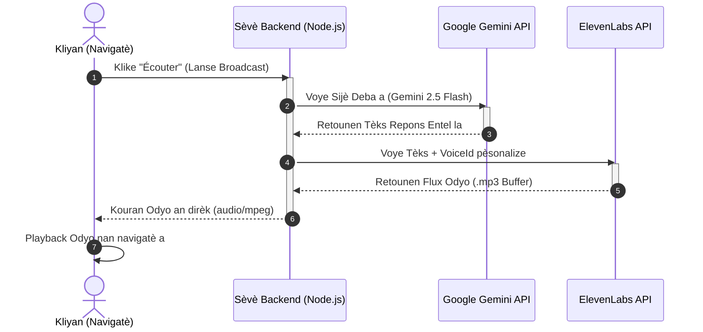

# Plan Deplwaye PRO pou Veltrix Broadcast (Odyo)

Dokiman sa a dekri plan teknik ak achitekti pou deplwaye sistèm **Broadcast Audio (Podcasts an dirèk)** la nan nivo Pwofesyonèl (PRO). Li montre kijan pou konekte entèlijans Gemini 2.5 Flash ak sentèz vokal ElevenLabs nan yon backend Node.js (Express).

---

## 1. Flux Okestrasyon Odyo a (Data Flow)

Men kijan enfòmasyon yo ap sikile ant navigatè itilizatè a, sèvè backend la, ak API yo :



---

## 2. Kòd Backend pou Sèvè Node.js (Express)

Devlopè w la ap kapab kreye wout sa a byen rapid nan backend Express la pou resevwa tèks la, chwazi vwa Entel la sou ElevenLabs, epi voye kouran odyo a dirèkteman bay kliyan an :

```javascript
/**
 * VELTRIX - ROUTE TTS (TEXT-TO-SPEECH) ELEVENLABS
 * Resevwa tèks deba a ak Voice ID Entel la, epi retounen odyo an dirèk.
 */
app.post('/api/generate-voice', async (req, res) => {
    try {
        const { text, voiceId } = req.body;

        if (!text || !voiceId) {
            return res.status(400).json({ error: "Tanpri bay tèks la ak voiceId a." });
        }
        
        // 1. Rele ElevenLabs API pou jenere odyo a
        const response = await fetch(`https://api.elevenlabs.io/v1/text-to-speech/${voiceId}`, {
            method: 'POST',
            headers: {
                'Content-Type': 'application/json',
                'xi-api-key': process.env.ELEVENLABS_API_KEY // Chaje depi nan .env lokal sekirize a
            },
            body: JSON.stringify({
                text: text,
                model_id: "eleven_monolingual_v1", // Modèl monoleng pou gwo kalite vokal
                voice_settings: { 
                    stability: 0.5, 
                    similarity_boost: 0.75 
                }
            })
        });

        if (!response.ok) {
            throw new Error(`ElevenLabs API Error: ${response.statusText}`);
        }
        
        // 2. Transfòme repons lan an ArrayBuffer pou voye l kòm kouran odyo
        const audioBuffer = await response.arrayBuffer();
        
        // 3. Konfigirasyon Header yo pou navigatè a konnen se odyo li ye
        res.set('Content-Type', 'audio/mpeg');
        res.send(Buffer.from(audioBuffer));

    } catch (error) {
        console.error("Erè nan jenerasyon vokal la:", error);
        res.status(500).json({ error: "Gen yon erè teknik ki pase nan sèvis vokal la." });
    }
});
```

---

## 3. Konfigirasyon Sekirite `.env`

Pou asire sekirite kle ElevenLabs la, nou dwe mete l nan menm fichye sekirite lokal [`.env`](file:///c:/Users/Miche/OneDrive/Bureau/Veltrix/.env) la :

```env
# ElevenLabs API Private Key (Pa janm pibliye sa sou GitHub !)
ELEVENLABS_API_KEY=cle_elevenlabs_pa_w_la_a
```

*(N ap rapèl ke fichye `.env` la deja ekskli nèt nan depo GitHub la gras ak `.gitignore` la pou evite nenpòt fwit sekirite).*

---

## 4. Kijan pou konekte l nan Frontend Dashboard la ?

Lè wout backend sa a pare, nan kòd Frontend la (paj [`veltrix_premium_dashboard.html`](file:///c:/Users/Miche/OneDrive/Bureau/Veltrix/veltrix_premium_dashboard%20(1).html)), nou ap jis ranplase fonksyon odyo ki mock a pa yon apèl dinamik konsa :

```javascript
// Egzamp Kòd Frontend pou jwe Odyo a nan Dashboard la :
async function playEntelVoice(text, voiceId) {
    const response = await fetch('/api/generate-voice', {
        method: 'POST',
        headers: { 'Content-Type': 'application/json' },
        body: JSON.stringify({ text, voiceId })
    });
    
    const audioBlob = await response.blob();
    const audioUrl = URL.createObjectURL(audioBlob);
    const audio = new Audio(audioUrl);
    audio.play();
}
```
