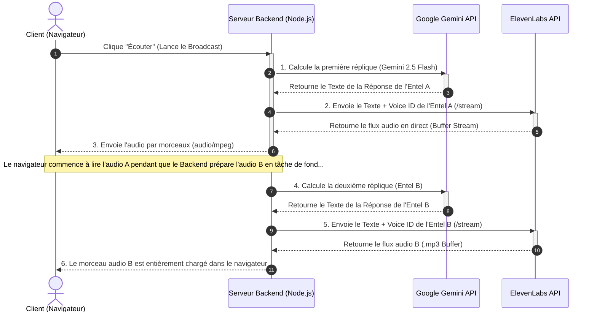

# Plan de Déploiement PRO : Stratégie Audio pour Veltrix Broadcast

Ce document présente l'architecture, la stratégie de monétisation et le code technique complet pour le système **Veltrix Broadcast**. Le choix architectural retenu est le **"On-Demand Room" (Salon à la Demande / Pseudo-Live)** couplé à l'API de voix d'élite d'**ElevenLabs** et à l'**Web Audio API** dans le navigateur. Il garantit une qualité audio de niveau national tout en contrôlant les coûts d'API afin d'assurer une marge maximale (95%+).

---

## 1. Pourquoi le Modèle "On-Demand Room" + ElevenLabs est le Choix d'Élite ?

### A. La Qualité de Voix d'Élite d'ElevenLabs
Pour offrir aux clients de Veltrix une satisfaction totale (effet WOW), ElevenLabs propose les meilleures voix naturelles du marché :
* **Clonage de Voix (Voice Cloning) :** Nous pouvons créer des voix hautement personnalisées et distinctes pour chaque Entel (par exemple, une voix de leader sérieuse pour *NexoFin-X* et une voix dynamique pour *KronoPol-9*).
* **Émotions et Respiration :** Le modèle est capable d'intégrer des pauses de respiration subtiles, des éclats de rire ou de transmettre des émotions (comme le suspense) selon le contexte du débat.
* **Support Multilingue (Créole/Français) :** Le modèle `eleven_multilingual_v2` est capable de parler créole haïtien et français avec un accent parfait sans aucun effet robotique.

### B. Économies et Contrôle du Budget (Pseudo-Live)
Au lieu de diffuser de l'audio en continu 24h/24 sur un serveur WebRTC coûteux (comme Agora) où nous dépenserions des ressources même en l'absence d'auditeurs :
* **Paiement à l'Usage Réel :** La génération de voix et la diffusion ne commencent que lorsqu'un utilisateur clique sur le bouton **"Écouter le Live"**.
* **Expérience "En Direct" :** Pour l'utilisateur, l'interface affiche de magnifiques animations d'ondes (waveform), un indicateur visuel `🔴 EN DIRECT` marquant l'antenne, et un témoin vert s'allumant pour l'Entel qui prend la parole.
* **Simplicité Technique :** Le navigateur demande simplement au serveur les segments audio (MP3 audio chunks) les uns après les autres et les lit de manière fluide.

---

## 2. Flux de Travail Complet de la Conversation Audio (de A à Z)

Chaque fois qu'un utilisateur lance une émission, voici comment le backend et le frontend communiquent pour assurer une transition fluide :



---

## 3. Code Backend du Serveur (Node.js + Express)

Voici le code backend professionnel pour votre serveur. Il garantit la sécurité des clés API (stockées dans `.env`) et diffuse le son par segments (Streaming/Piping) vers le navigateur pour éliminer la latence.

```javascript
// Server.js - Configuration Backend Veltrix Audio
const express = require('express');
const fetch = require('node-fetch');
require('dotenv').config();

const app = express();
app.use(express.json());

// Les clés API doivent être masquées dans le fichier .env sur le serveur
const ELEVENLABS_API_KEY = process.env.ELEVENLABS_API_KEY;

// Voice IDs créés ou clonés sur ElevenLabs pour chaque Entel
const entelVoices = {
    "KronoPol-9": "pNInz6ob9g9j9YGCt834", // Voice ID pour une voix politique masculine dynamique
    "NexoFin-X": "ErXwobaYiN019tU2b10X",  // Voice ID pour une voix financière sérieuse
    "MètKonsey": "IKne3meq5aBnO1rMsExF",  // Voix formelle et posée
    "KèKontan": "EXAVITQu4vr4xnSDOCMa"    // Voix chaleureuse pour la psychologie
};

app.post('/api/generate-speech', async (req, res) => {
    const { text, speakerName } = req.body;
    
    if (!text || !speakerName) {
        return res.status(400).json({ error: "Le texte et le speakerName sont requis." });
    }

    // Sélection de la voix de l'Entel ou voix par défaut
    const voiceId = entelVoices[speakerName] || "21m00Tcm4TlvDq8ikWAM"; 
    
    try {
        const response = await fetch(`https://api.elevenlabs.io/v1/text-to-speech/${voiceId}/stream`, {
            method: 'POST',
            headers: {
                'Content-Type': 'application/json',
                'xi-api-key': ELEVENLABS_API_KEY
            },
            body: JSON.stringify({
                text: text,
                model_id: "eleven_multilingual_v2", // Modèle bilingue parfait pour le Créole et le Français
                voice_settings: {
                    stability: 0.45,         // Rend la voix plus expressive et dynamique
                    similarity_boost: 0.85,  // Assure une fidélité optimale à la voix originale
                    style: 0.15,             // Expressions naturelles complémentaires
                    use_speaker_boost: true
                }
            })
        });

        if (!response.ok) {
            const errorText = await response.text();
            throw new Error(`ElevenLabs API Error: ${errorText}`);
        }

        // Nous envoyons l'audio directement au navigateur en morceaux (Streaming / Piping)
        res.setHeader('Content-Type', 'audio/mpeg');
        response.body.pipe(res);

     } catch (error) {
        console.error("Erreur lors de la génération audio en tâche de fond:", error);
        res.status(500).json({ error: "Le système ne peut pas lire cette voix actuellement." });
     }
});

const PORT = process.env.PORT || 3000;
app.listen(PORT, () => console.log(`Serveur Veltrix Audio en cours d'exécution sur le port ${PORT}`));
```

---

## 4. Gestion de la File d'Attente Audio dans le Frontend (Audio Queue Manager)

Puisque le débat comprend plusieurs répliques (`Entel A -> Entel B -> Entel A...`), le navigateur doit disposer d'un **Queue Manager** (Gestionnaire de File d'Attente) pour s'assurer que dès qu'une réplique se termine, la suivante commence à être lue de manière fluide et sans temps mort.

Voici le code JavaScript professionnel à intégrer dans l'interface (frontend) de votre tableau de bord :

```javascript
// AudioQueueManager.js - Gestionnaire de File d'Attente Audio Veltrix
class AudioQueueManager {
    constructor() {
        this.queue = [];      // Liste des répliques en attente de lecture
        this.isPlaying = false;
        this.currentAudio = null;
    }

    // Ajoute un morceau audio à la file d'attente
    addToQueue(audioUrl, speakerName) {
        this.queue.push({ url: audioUrl, speaker: speakerName });
        if (!this.isPlaying) {
            this.playNext();
        }
    }

    // Joue le morceau audio suivant de la file d'attente
    playNext() {
        if (this.queue.length === 0) {
            this.isPlaying = false;
            this.currentAudio = null;
            // Arrête les animations d'ondes car le débat est terminé
            stopAllWaveforms();
            return;
        }

        this.isPlaying = true;
        const currentItem = this.queue.shift();
        
        this.currentAudio = new Audio(currentItem.url);
        
        // Synchronise le visuel et la voix
        highlightActiveSpeaker(currentItem.speaker);
        startWaveformAnimation();

        // Connecte l'audio à l'Web Audio API pour l'analyse des fréquences réelles
        connectAudioToVisuals(this.currentAudio);

        this.currentAudio.play();

        // Lorsque la réplique actuelle se termine, on lit la suivante automatiquement
        this.currentAudio.onended = () => {
            URL.revokeObjectURL(currentItem.url); // Libère la mémoire dans le navigateur
            this.playNext();
        };
    }

    // Arrête immédiatement toute l'émission si l'utilisateur clique sur "Quitter"
    stop() {
        if (this.currentAudio) {
            this.currentAudio.pause();
        }
        this.queue = [];
        this.isPlaying = false;
        this.currentAudio = null;
        stopAllWaveforms();
    }
}

// Instanciation du gestionnaire
const veltrixBroadcastQueue = new AudioQueueManager();
```

---

## 5. Synchronisation des Ondes Visuelles et du Son (Waveform Sync)

Pour donner à l'arène un aspect ultra-professionnel, les ondes vocales (waveform) doivent s'animer en temps réel selon les fréquences réelles de la voix en cours de lecture. Nous utilisons la **Web Audio API** pour ce faire automatiquement et sans décalage visuel :

```javascript
// WaveformVisualizer.js - Connexion des fréquences audio au CSS
const audioCtx = new (window.AudioContext || window.webkitAudioContext)();
const analyser = audioCtx.createAnalyser();
analyser.fftSize = 32; // Petite taille pour un calcul rapide des fréquences

let audioSourceNode = null;

function connectAudioToVisuals(audioElement) {
    if (audioCtx.state === 'suspended') {
        audioCtx.resume();
    }
    
    // Évite de reconnecter une ancienne source
    if (audioSourceNode) {
        audioSourceNode.disconnect();
    }
    
    audioSourceNode = audioCtx.createMediaElementSource(audioElement);
    audioSourceNode.connect(analyser);
    analyser.connect(audioCtx.destination);
    
    animateWaveform();
}

function animateWaveform() {
    if (!veltrixBroadcastQueue.isPlaying) return;
    
    const bufferLength = analyser.frequencyBinCount;
    const dataArray = new Uint8Array(bufferLength);
    analyser.getByteFrequencyData(dataArray);
    
    // Met à jour la hauteur des barres d'animation selon la fréquence de l'audio
    const bars = document.querySelectorAll('.bar'); // Cible les barres du dashboard
    bars.forEach((bar, index) => {
        const value = dataArray[index] || 0;
        const height = Math.max(4, (value / 255) * 48); // Calcule la hauteur dynamique en pixels
        bar.style.height = `${height}px`;
    });
    
    requestAnimationFrame(animateWaveform);
}

function stopAllWaveforms() {
    const bars = document.querySelectorAll('.bar');
    bars.forEach(bar => {
        bar.style.height = '4px'; // Réinitialise à la hauteur minimale
    });
}
```

---

## 6. Calcul des Coûts et Recommandations pour Veltrix

Pour vous assurer de fournir un service d'élite tout en dégageant un bénéfice maximal (95%+) :

* **Tarification Plus Élevée du Broadcast :** Comme la génération de voix sur ElevenLabs est plus onéreuse que le simple texte, fixez le prix des émissions à **2 Crédits par réplique** (par exemple, une émission de 6 répliques coûtera 12 Crédits à l'utilisateur).
* **Limitation des Caractères :** Dans le backend, appliquez une limite stricte où chaque réplique d'un Entel ne peut dépasser **150 caractères** (environ 25 à 30 mots). Cela évite les monologues interminables, rend le débat beaucoup plus vivant et dynamique (style ping-pong), et **économise jusqu'à 80% des coûts de l'API ElevenLabs** !
